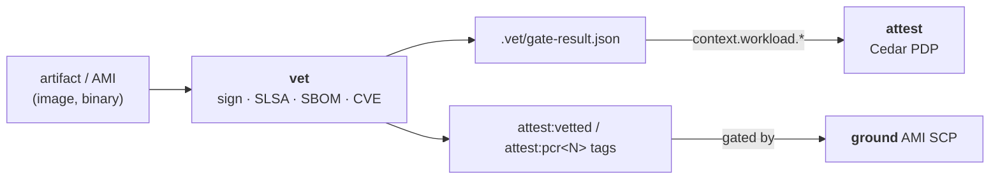

# vet

**Software supply chain verification for AWS Secure Research Environments**

Part of the [Provabl](https://provabl.dev) suite:
- **[ground](https://ground.provabl.dev)** — deploy correct AWS foundations
- **[attest](https://attest.provabl.dev)** — compile, enforce, and prove compliance
- **[qualify](https://qualify.provabl.dev)** — train and qualify researchers
- **vet** — vet your software ← you are here

> Ground your infrastructure, attest your controls, qualify your people, vet your software, steward your data.

---

## What vet does

vet verifies software artifacts before they are permitted to access sensitive data in
an SRE. Where qualify qualifies the *person*, vet qualifies the *software*.



```bash
vet sign    image:tag            # sign artifact via Sigstore keyless
vet verify  image:tag            # verify SLSA provenance + CVE status
vet sbom    image:tag --attest   # generate and attest SBOM
vet gate    image:tag            # write Cedar workload attributes for attest
vet gate    ami-0abc --tag-vetted  # vet an AWS AMI and tag attest:vetted=true (see below)
vet ami-reference ami-0abc --pcr 0=… # record golden boot PCR(s) on a vetted AMI (see below)
```

## Core concepts

The handful of ideas to hold (terms link to the suite [glossary](https://github.com/provabl/provabl/blob/main/docs/guide/glossary.md)):

- **[SLSA](https://github.com/provabl/provabl/blob/main/docs/guide/glossary.md#slsa) provenance** — how trustworthy an artifact's build chain is; vet verifies the level via [cosign/Sigstore](https://github.com/provabl/provabl/blob/main/docs/guide/glossary.md#cosign--sigstore).
- **[SBOM](https://github.com/provabl/provabl/blob/main/docs/guide/glossary.md#sbom-software-bill-of-materials) + [CVE](https://github.com/provabl/provabl/blob/main/docs/guide/glossary.md#cve) check** — vet generates the bill of materials and checks each package against known vulnerabilities (OSV); **fails closed** if a requested check can't run.
- **[Lowered attribute](https://github.com/provabl/provabl/blob/main/docs/guide/glossary.md#lowered-attribute)** — vet's verdict becomes `.vet/gate-result.json` (→ `context.workload.*`) and, for AMIs, the `attest:vetted` / `attest:pcr<N>` tags attest/ground gate on.
- **vet the software, not the person** — vet qualifies *artifacts*; qualify qualifies *people*. Together they cover both things that must be trusted before data access.

## Install

```bash
go install github.com/provabl/vet/cmd/vet@latest   # requires Go 1.26.4+
# or build from a clone: go build ./cmd/vet
```

**Prerequisites.** Go 1.26.4+, the external tools below (cosign/gh/syft, each only for the checks that
use it), and — for AMI vetting — AWS credentials with `ec2:CreateTags` as the vetter principal (run
`vet preflight` to check). CVE checks reach the OSV API over HTTPS; no AWS access is needed for the
software (sign/verify/sbom/gate) flow.

## Required external tools

vet shells out to standard supply-chain tools; each is needed only for the checks that use it:

| Tool | Used by | Needed for |
|---|---|---|
| [cosign](https://github.com/sigstore/cosign) | `vet sign`, `vet verify`, `vet sbom --attest` | Sigstore keyless signing + signature verification |
| [`gh`](https://cli.github.com) | `vet verify --source` | SLSA provenance (`gh attestation verify`) |
| [syft](https://github.com/anchore/syft#installation) | `vet sbom` | SBOM generation (SPDX / CycloneDX) |

CVEs are queried from the [OSV API](https://osv.dev) over HTTPS (no local tool) using the packages
parsed from a stored SBOM. **vet fails closed**: if a requested check's tool or input is missing —
`--source` without `gh`, or `--check-cves` without an SBOM — verify reports a policy violation
rather than silently passing.

## AMI vetting (gate AMI launches)

vet also vets an **AWS AMI** (`ami-...` target). On a passing gate, `--tag-vetted` writes the
`attest:vetted=true` tag to the AMI via the EC2 API:

```bash
vet verify ami-0abc123 --source github.com/org/image-pipeline   # record the verdict
vet gate   ami-0abc123 --tag-vetted --region us-east-1          # tag attest:vetted=true if it passes
```

That tag is exactly what [ground](https://github.com/provabl/ground)'s AMI-launch-gating SCP
requires to permit `ec2:RunInstances`, and a companion lockdown SCP restricts who may set it to a
designated **vetter principal** — so the principal running `vet gate --tag-vetted` (vet's CI) must
be that vetter. On a failing gate, **no tag is written** (fail-closed), so an un-vetted AMI stays
un-launchable.

**Scope/trust note (v1):** this asserts the AMI's *provenance/verdict* and an *authenticated vetter
marking* — not a deep guarantee about the image's disk contents. Deep AMI-content scanning (Amazon
Inspector, or EBS-snapshot → syft) is a pluggable source recorded via the usual `--check-cves`/SBOM
path, not yet generated by vet.

### Binding the running instance to the vetted image (golden PCR)

Tagging an AMI vetted gates *which image id* may launch; to also bind the *running instance* to that
image, record the AMI's known-good boot measurement and check it at attestation. Measured-boot PCRs
**cannot be computed offline from an AMI** — capture them from a trusted **reference boot**:

```bash
# 1. launch the vetted AMI on a TRUSTED instance, then on that instance:
tpm attest --device            # (or: nitro attest --device, for an enclave)
# 2. read the measured PCRs from the attestation output:
#      .tpm/attestation.json   → tpm_pcrs   (e.g. "0", "7")
#      .nitro/attestation.json → pcr0/pcr8
# 3. record them as locked golden tags on the AMI (run as the vetter principal):
vet ami-reference ami-0abc123 --pcr 0=<hex> --pcr 7=<hex> --region us-east-1
# → writes attest:pcr0=<hex>, attest:pcr7=<hex>

# 4. at launch, on the instance, enforce the match — auto-loads the golden tags from the source AMI:
tpm attest --device --expected-from-ami        # (or: nitro attest --device --expected-from-ami)
#   reads this instance's source-AMI id from IMDS, pulls its attest:pcr* tags, and requires the match;
#   a measured boot that diverges from the vetted reference fails attestation.
#   (--expected-pcrN still works for a manual override.)
```

The `attest:pcr*` tags are locked to the vetter principal by ground's lockdown SCP (a forgeable
golden PCR would defeat the binding). **Trust boundary:** the binding is only as strong as (a) the
*reference boot* being genuinely known-good and (b) the golden tags staying locked to the vetter.

## Status

🚧 **Under active development** — initial CLI being built.

## Open source

vet is fully open source (Apache 2.0) with no commercial tier. It integrates with [attest](https://attest.provabl.dev) by writing Cedar workload attributes that the attest Cedar PDP evaluates. See [COMMERCIAL.md](COMMERCIAL.md).

## License

Apache 2.0. Copyright 2026 Playground Logic LLC.
